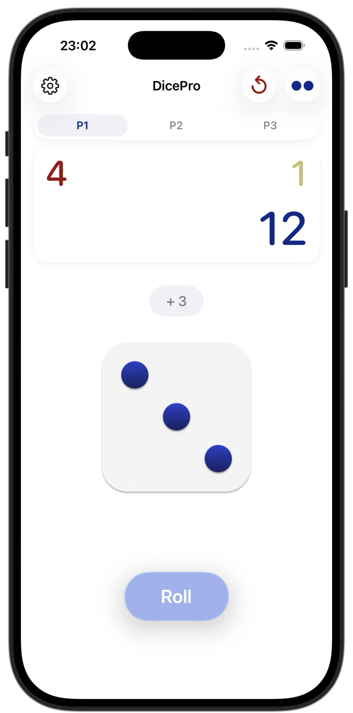
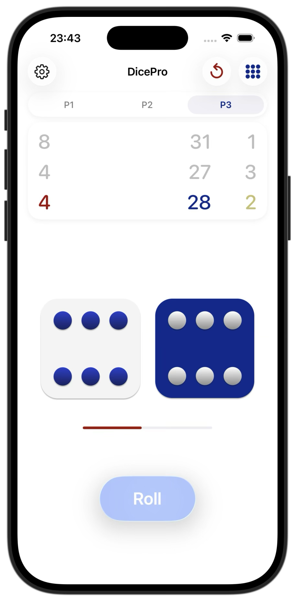
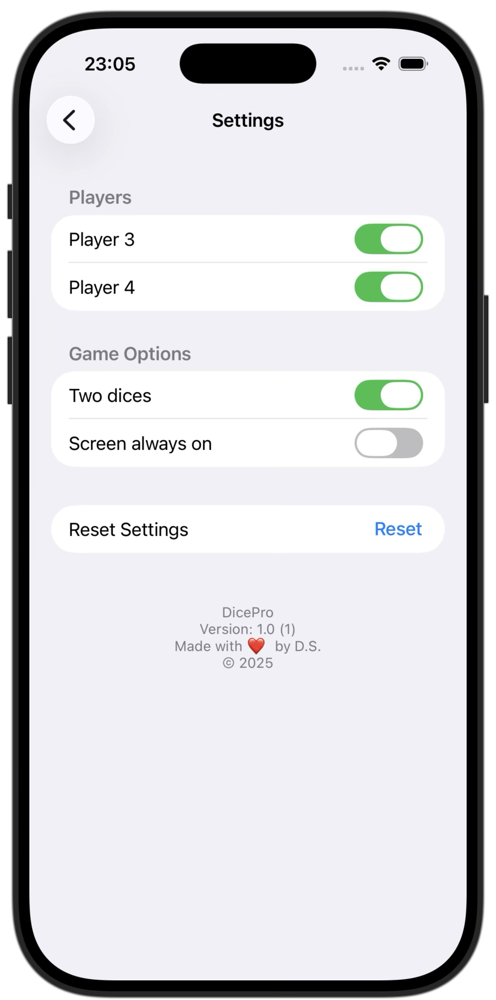

# DicePro

DicePro is a lightweight iOS dice rolling app built with UIKit and fully programmatic UI. 
The project demonstrates clean structure, adaptive layout, and smooth interactions.

<p align="center">
  
</p>

## Screenshots

<p align="center">
  
  
  
</p>

## Purpose

DicePro solves a simple but common problem:
providing a clean, intuitive, and fast way to roll one or two dice during board games or casual play.

The app focuses on:
	•	eliminating physical dice when not available,
	•	providing clear score tracking for up to four players,
	•	offering a distraction-free, high-contrast UI that is easy to use during a game,
	•	adding animations that make digital dice feel more “alive”.

This project demonstrates practical UIKit skills, state management, adaptive layout, and clean architecture — all wrapped in a minimal, polished user experience.

## Features

- Roll one or two dice with tap or long press.
- Long-press gesture with animated rolling and progress indicator.
- Per-player score tracking: current roll, total score, attempts, and rank.
- Up to four players with quick switching.
- Two layout mode:
  - **Row** — focused view for the active player.
  - **Grid** — overview of all players.
- Settings screen:
  - enable/disable Player 3 and Player 4,
  - switch between one or two dice,
  - keep the screen always on during the game.
- Persistent storage for game state and user preferences.

## Tech Stack

- **Swift, UIKit**, fully programmatic UI (no Storyboards)
- **Auto Layout**, UIStackView
- **MVC architecture**
- Persistence via `Codable` + `UserDefaults`
- Adaptive layout: `ScreenClass` + `scaleFactor` for different devices (SE, mini, normal, Pro Max, iPad).
- Custom UI Components
- Basic animations

## Project Structure

```text
Controller/
    DiceViewController.swift          // main game screen
    SettingsViewController.swift      // settings screen

Model/
    DiceModel.swift                   // dice logic and game operations
    GameData.swift                    // players, scores, ranks
    Settings.swift                    // user settings model

Storage/
    GameStorage.swift                 // load/save game state
    SettingsStorage.swift             // load/save settings

View/
    ScoresView.swift                  // players’ scores, attempts, ranks UI

Extensions/
    Animational.swift                  // small UI helpers (fade, image change, etc.)
    Colors.swift                       // centralized app color palette
    Global.swift                       // screen classes, scaleFactor, enums

```

## Requirements
 - **OS 16.6+**
 - Xcode 16+


## Installation

Clone the repository and open the project in Xcode:

```bash
git clone https://github.com/dsokolovdev/DicePro.git
cd DicePro
open DicePro.xcodeproj
```

## ❤️ Author

Created by Dmitry Sokolov  
© 2025
